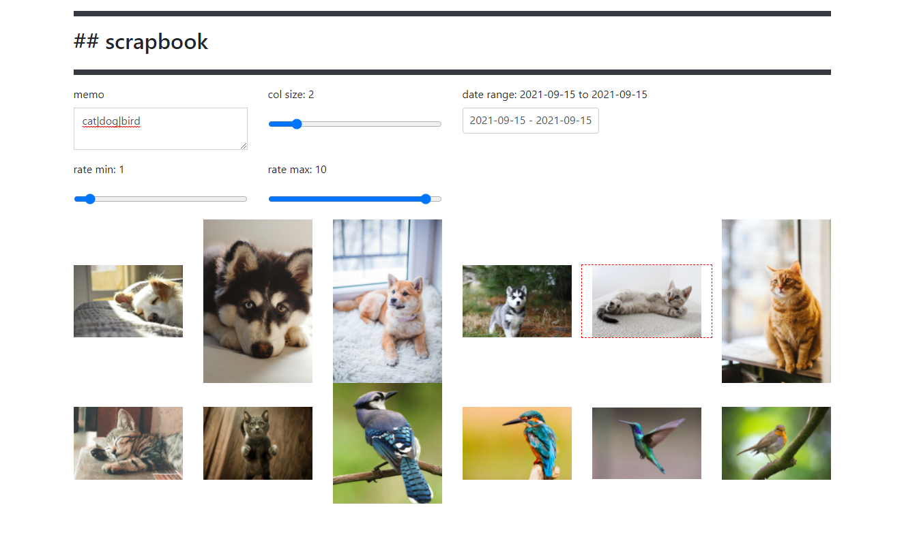
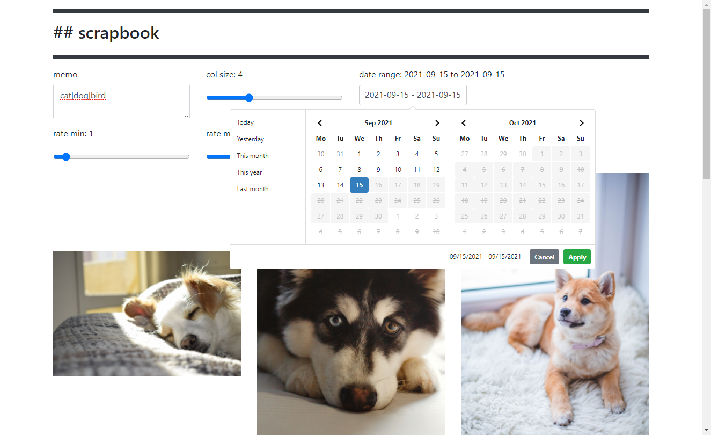
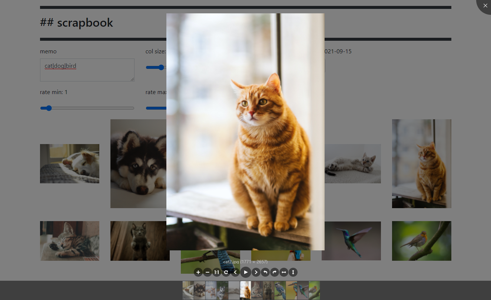

# scrapbook

Collecting images and photos like a pro.





## Demo 

[demo](https://yuis-ice.github.io/scrapbook/demo/scrapbook/index.html)

## Usage 

Simple. 

```
./main.js --datadir [image directory] -p [port]

# e.g. 
./main.js --datadir ./demo -p 8114
```

## scrapbook.config.yml

Place your config file named `scrapbook.config.yml` on the root of the image directory.

The format is like: 

```yml 
meta: 
  date_format: YYYY/MM/DD

database: 

  - date: 2021/9/12
    rate: 2
    memo: dog
    path: ./dog1.jpg

  - date: 2021/9/13
    rate: 3
    memo: dog
    path: ./dog2.jpg

  - date: 2021/9/14
    rate: 4
    memo: dog
    path: ./dog3.jpg
```

You can see the full example of the file at `./demo/scrapbook.config.yml`

## Development

1. run the webpack server 

```
npm run-script dev
```

or just build

```
npm run-script build 
```

2. run the express.js web server

```
npm run-script demo 
```


3. open the localhost url e.g. http://localhost:8114/scrapbook/

## tmp 

.. 
